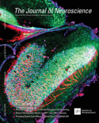
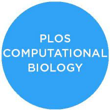
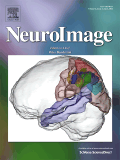
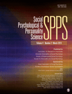
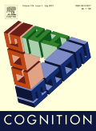
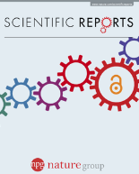
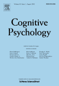
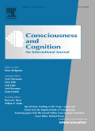

I'm a postdoctoral research fellow in cognitive neuroscience at The University of Melbourne. I use neurophysiological (EEG), computational, and behavioural approachs to study how our brains make sense of visual information. My current work focusses on predictive delay-compensation mechanisms. These enable us to feel as if we are living in the present moment, rather than lagging behind the world, despite neural transmission and sensory processing delays. 

I currently work in the [Time in Brain and Behaviour Lab](https://psychologicalsciences.unimelb.edu.au/research/msps-research-groups/timing) at The University of Melbourne with [Hinze Hogendoorn](https://scholar.google.com/citations?user=uOh2Ik0AAAAJ&hl=en&inst=4522501446918153378&oi=ao). Previously, I completed my PhD in the [Decision Neuroscience Lab](https://dlab.unimelb.edu.au/) under the supervision of [Stefan Bode](https://scholar.google.com/citations?user=nPX76iMAAAAJ&hl=en&oi=ao), [Daniel Feuerriegel](https://scholar.google.com.au/citations?user=XPrVRCoAAAAJ&hl=en) and [Rob Hester](https://scholar.google.com/citations?hl=en&user=vma8HZ0AAAAJ) investigating perceptual decision making and metacognition.

___

### Publications

Ko, Feuerriegel, **Turner**, Overhoff, Niessen, Stahl, Hester, Fink, Weiss, & Bode (2022). Divergent effects of absolute evidence magnitude on decision accuracy and confidence in perceptual judgements. *Cognition*. <a href="../files/Ko_et_al_2022.pdf"><i class="fas fa-file-pdf"></i> | [Journal Link](https://www.sciencedirect.com/science/article/pii/S0010027722001135?dgcid=coauthor) | [Code + data](https://osf.io/r8vfx/) 

**Turner** (2022). Unravelling the neural mechanisms which encode rapid streams of visual input. *The Journal of Neuroscience*. <a href="../files/Turner_2022.pdf"><i class="fas-solid fa-file-pdf"></i> | [Journal Link](https://www.jneurosci.org/content/42/7/1170)

**Turner**, Feuerriegel, Hester & Bode (2022). Initial sensory information biases the likelihood and speed of subsequent changes of mind. *PLOS Computational Biology*. [Paper](../files/Turner_2022.pdf) | [Journal Link](https://journals.plos.org/ploscompbiol/article?id=10.1371/journal.pcbi.1009738) [Code + data](https://osf.io/a6u4n/) 

Feuerriegel, Jiwa, **Turner**, Andrejević, Hester, Bode (2021). Tracking dynamic adjustments to decision making and performance monitoring processes in conflict tasks. *NeuroImage*. [Paper](../files/Turner_2022.pdf) | [Journal Link](https://www.sciencedirect.com/science/article/pii/S1053811921005413) [Code + data](https://osf.io/eucqf/) 

Andrejević, Feuerriegel, **Turner**, Laham, Bode (2021). How do Basic Personality Traits Map onto Moral Judgements of Fairness-related Actions. *Social Psychology and Personality Science*. [Paper](../files/Turner_2022.pdf) | [Journal Link](https://journals.sagepub.com/doi/abs/10.1177/19485506211038295) [Code + data](https://t.co/LLbTuAhtNc) 

**Turner**, Angdias, Feuerriegel, Chong, Hester, & Bode (2021). Perceptual decision confidence is sensitive to foregone effort expenditure. *Cognition*. [Paper](../files/Turner_2022.pdf) | [Journal Link](https://www.sciencedirect.com/science/article/pii/S0010027720303449) [Code + data](https://osf.io/cg74z/) 

Andrejević, Feuerriegel, **Turner**, Laham, Bode (2020). Moral Judgements of Fairness-Related Actions are Flexibly Updated to Account for Contextual Information. *Scientific Reports*. [Paper](../files/Turner_2022.pdf) | [Journal Link](https://www.nature.com/articles/s41598-020-74975-0) [Code + data](https://osf.io/xcbuh/) 

**Turner**, Feuerriegel, Andrejević, Hester, & Bode (2020). Perceptual change-of-mind decisions are sensitive to absolute evidence magnitude. *Cognitive Psychology*. [Paper](../files/Turner_2022.pdf) | [Journal Link](https://www.sciencedirect.com/science/article/pii/S0010028520300876) [Code + data](https://osf.io/sr58p/) 

**Turner**, Johnston, de Boer, Morawetz, & Bode (2017). Multivariate pattern analysis of event-related potentials predicts the subjective relevance of everyday objects. *Consciousness and Cognition*. [Paper](../files/Turner_2022.pdf) | [Journal Link](https://www.sciencedirect.com/science/article/pii/S1053810017300417)

