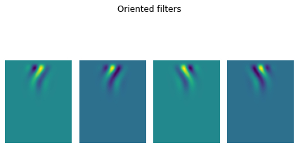

### A python-based motion energy filtering demo
As a fun exercise I recently translated George Mather's [excellent motion energy filtering demo](http://www.georgemather.com/Model.html) from MATLAB into python. The GitHub repo with python code and stimulus files can be found [here](https://github.com/bootstrapbill/motion-energy-python-translation). 

### What is motion energy filtering?
A surprisingly powerful observation is that motion manifests as oriented structure in space-time. If you're reading about this for the first time and that feels completely incomprehensible (it certainly was for me!) I'd recommend checking out this [blog post](https://jake.vision/blog/motion-illusions/) by Jacob Yates, which does a far better job of explaining this concept than I ever could. Seriously, go check it out, it's impressively entertaining and informative.

Motion energy filtering is essentially the process of building detectors ('filters') which are sensitive to orientation in space-time, providing a beautifully simple means of detecting motion. Its generally thought that this is what our visual system does to detect motion! 

I've plotted what the filters generated in the demo look like. Notice how they contain diagonally oriented streaks... that's what enables them to look for oriented structure in space time (i.e., motion)! 

The original paper on motion energy filtering by Adelson and Bergen can be found [here](https://opg.optica.org/josaa/fulltext.cfm?uri=josaa-2-2-284&id=1945). It's somewhat dense if you're not mathematically minded, but its truly a beautiful paper once you wrap your head around things. I'd recommend reading it after going through Jacob's blog, before you dive into the code.

### Additional resources

The current demo considers 1D motion. For more complex (2D motion) demos see [this great MATLAB toolbox](https://github.com/anne-urai/motion_energy_filtering) by Anne Urai and Klaus Wimmer, which also contains links to additional resources. 

Finally, please let me know if you spot any issues with my translation (my email can be found on the homepage)!  